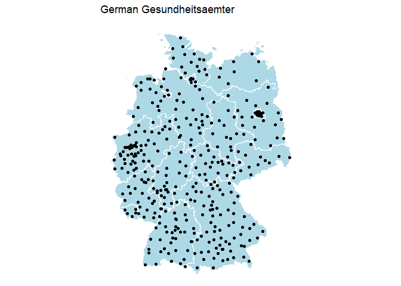

<!-- README.md is generated from README.Rmd. Please edit that file -->

# sormasmap

<!-- badges: start -->

<!-- badges: end -->

`sormasmap` is an R package with the goal to visualize the current
spread of the [SORMAS app](http://www.sormas.org) within Germany. The
package is primarily used for generating and embedding `leaflet` and
`ggplot` graphs. Contributions highly welcome.

## Installation

You can install the released version of sormasmap with:

``` r
devtools::install_github("gstephan/sormasmap")
```

## Geo code and zip code of all German Gesundheitsaemter

One of the primary key features is an overview of all German
Gesundheitsaemter. The data is generated from the [RKI PLZ
Tool](https://tools.rki.de/plztool/) with its [data
source](https://www.rki.de/DE/Content/Infekt/IfSG/Software/software_node.html).
This data has all German Gesundheitsaemter in it with all associated ZIP
codes. Data is exctracted from the xml file.

Attached to this data are the geo locations with its longitude and
latitude for visualization purposes. The geo location is received via
the `ggmap` interface to google maps. Package documentation for the
setup can be seen [here](https://github.com/dkahle/ggmap).

The data is nested, implicating that some google maps data variables and
RKI PLZ tool variables are nested and they can be explored via the
e.g. `tidyr`s `unnest()` functions.

``` r
library(sormasmap)
gesundheitsaemter
#> # A tibble: 399 x 13
#>    id    name  department street postalcode place plz_rki gemeinden  long   lat
#>    <chr> <chr> <chr>      <chr>  <chr>      <chr> <list>  <list>    <dbl> <dbl>
#>  1 1     Stad~ Fachberei~ Norde~ 24939      Flen~ <chr [~ <chr [14~  9.43  54.8
#>  2 2     Land~ Amt für G~ Fleet~ 24103      Kiel  <chr [~ <chr [31~ 10.1   54.3
#>  3 3     Hans~ Gesundhei~ Sophi~ 23560      Lübe~ <chr [~ <chr [11~ 10.7   53.9
#>  4 4     Stad~ Gesundhei~ Meßto~ 24534      Neum~ <chr [~ <chr [12~  9.99  54.1
#>  5 5     Krei~ Fachdiens~ Esmar~ 25746      Heide <chr [~ <chr [10~  9.08  54.2
#>  6 6     Krei~ Fachdiens~ Damm 8 25813      Husum <NULL>  <chr [11~  9.05  54.5
#>  7 7     Krei~ Fachdiens~ Holst~ 23701      Eutin <chr [~ <chr [36~ 10.6   54.1
#>  8 8     Krei~ Fachdiens~ Kurt-~ 25337      Elms~ <chr [~ <chr [37~  9.70  53.7
#>  9 9     Krei~ Fachdiens~ Kaise~ 24768      Rend~ <NULL>  <chr [10~  9.67  54.3
#> 10 10    Krei~ Fachdiens~ Moltk~ 24837      Schl~ <chr [~ <chr [72~  9.56  54.5
#> # ... with 389 more rows, and 3 more variables: plz_google <chr>,
#> #   data_rki <list>, data_google <list>
```

As an example, you are interested in one region, here the Thuringian
city Eisenach. Select important variables:

``` r
library(dplyr)
library(tidyr)

gesus <- gesundheitsaemter %>% 
  select(name, postalcode, plz_rki, gemeinden, long, lat) 
gesus
#> # A tibble: 399 x 6
#>    name                        postalcode plz_rki    gemeinden    long   lat
#>    <chr>                       <chr>      <list>     <list>      <dbl> <dbl>
#>  1 Stadt Flensburg             24939      <chr [5]>  <chr [14]>   9.43  54.8
#>  2 Landeshauptstadt Kiel       24103      <chr [17]> <chr [31]>  10.1   54.3
#>  3 Hansestadt Lübeck           23560      <chr [12]> <chr [11]>  10.7   53.9
#>  4 Stadt Neumünster            24534      <chr [5]>  <chr [12]>   9.99  54.1
#>  5 Kreis Dithmarschen          25746      <chr [31]> <chr [103]>  9.08  54.2
#>  6 Kreis Nordfriesland         25813      <NULL>     <chr [111]>  9.05  54.5
#>  7 Kreis Ostholstein           23701      <chr [27]> <chr [36]>  10.6   54.1
#>  8 Kreisverwaltung Pinneberg   25337      <chr [28]> <chr [37]>   9.70  53.7
#>  9 Kreis Rendsburg-Eckernförde 24768      <NULL>     <chr [105]>  9.67  54.3
#> 10 Kreis Schleswig-Flensburg   24837      <chr [70]> <chr [72]>   9.56  54.5
#> # ... with 389 more rows
```

Subset your data:

``` r
eisenach_gesu <- gesus %>% 
  unnest(gemeinden) %>% 
  filter(grepl("Eisenach", gemeinden))
eisenach_gesu
#> # A tibble: 2 x 6
#>   name                                postalcode plz_rki   gemeinden  long   lat
#>   <chr>                               <chr>      <list>    <chr>     <dbl> <dbl>
#> 1 Kreisverwaltung  Eifelkreis Bitbur~ 54634      <chr [35~ Eisenach   6.52  50.0
#> 2 Landratsamt Wartburgkreis           36433      <chr [23~ Eisenach  10.2   50.8
```

Unnest all possilbe Zip code ranges of the Gesundheitsamt that the city
Eisenach is associated with:

``` r
eisenach_gesu %>% 
  filter(grepl("Wartburgkreis", name)) %>% 
  unnest(plz_rki) %>% 
  print(n = 30)
#> # A tibble: 23 x 6
#>    name                      postalcode plz_rki gemeinden  long   lat
#>    <chr>                     <chr>      <chr>   <chr>     <dbl> <dbl>
#>  1 Landratsamt Wartburgkreis 36433      36404   Eisenach   10.2  50.8
#>  2 Landratsamt Wartburgkreis 36433      36414   Eisenach   10.2  50.8
#>  3 Landratsamt Wartburgkreis 36433      36419   Eisenach   10.2  50.8
#>  4 Landratsamt Wartburgkreis 36433      36433   Eisenach   10.2  50.8
#>  5 Landratsamt Wartburgkreis 36433      36448   Eisenach   10.2  50.8
#>  6 Landratsamt Wartburgkreis 36433      36452   Eisenach   10.2  50.8
#>  7 Landratsamt Wartburgkreis 36433      36456   Eisenach   10.2  50.8
#>  8 Landratsamt Wartburgkreis 36433      36457   Eisenach   10.2  50.8
#>  9 Landratsamt Wartburgkreis 36433      36460   Eisenach   10.2  50.8
#> 10 Landratsamt Wartburgkreis 36433      36466   Eisenach   10.2  50.8
#> 11 Landratsamt Wartburgkreis 36433      36469   Eisenach   10.2  50.8
#> 12 Landratsamt Wartburgkreis 36433      37005   Eisenach   10.2  50.8
#> 13 Landratsamt Wartburgkreis 36433      99817   Eisenach   10.2  50.8
#> 14 Landratsamt Wartburgkreis 36433      99819   Eisenach   10.2  50.8
#> 15 Landratsamt Wartburgkreis 36433      99820   Eisenach   10.2  50.8
#> 16 Landratsamt Wartburgkreis 36433      99826   Eisenach   10.2  50.8
#> 17 Landratsamt Wartburgkreis 36433      99830   Eisenach   10.2  50.8
#> 18 Landratsamt Wartburgkreis 36433      99831   Eisenach   10.2  50.8
#> 19 Landratsamt Wartburgkreis 36433      99834   Eisenach   10.2  50.8
#> 20 Landratsamt Wartburgkreis 36433      99837   Eisenach   10.2  50.8
#> 21 Landratsamt Wartburgkreis 36433      99842   Eisenach   10.2  50.8
#> 22 Landratsamt Wartburgkreis 36433      99846   Eisenach   10.2  50.8
#> 23 Landratsamt Wartburgkreis 36433      99848   Eisenach   10.2  50.8
```

This information prepares the visualization.

## Map of all German Gesundheitsaemter

``` r
library(ggplot2)
library(raster)
```

Get German Bundesland map data

``` r
germany <- getData(country = "Germany", level = 1)
```

Plot the data:

``` r
gesundheitsaemter %>%
  ggplot(aes(long, lat)) +
  geom_polygon(
    data = germany,
    aes(long, lat, group = group),
    colour = "white",
    fill = "#add8e6") +
  geom_point() +
  coord_map() +
  theme_void() +
  labs(title = "German Gesundheitsaemter")
```

<!-- -->
